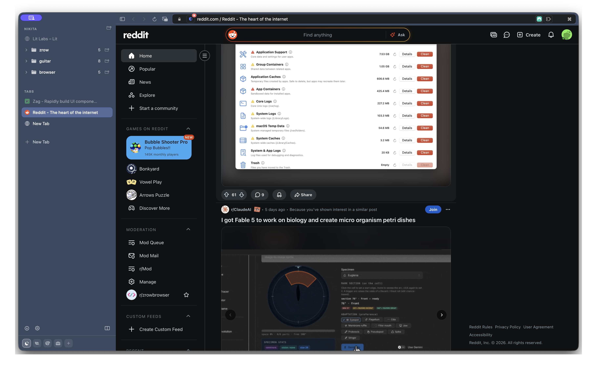
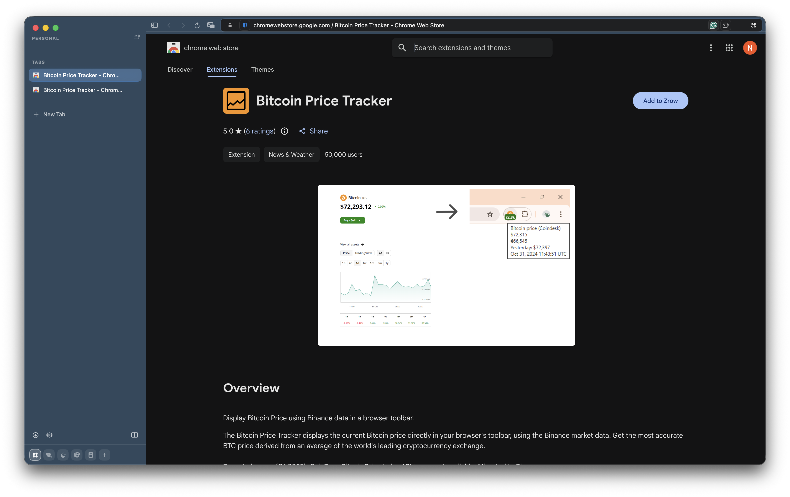

# Zrow Browser

A native macOS browser built on SwiftUI and WebKit (WKWebView), not Chromium.
It keeps the Arc-class shell, Spaces, link routing, and Chrome extensions, while
staying light on memory and battery because it shares the engine the system
already runs.

> **Public preview — alpha.** Zrow Browser is early software, open to everyone.
> It moves fast and may break. See [Status & license](#status--license) below.

This repository hosts the public release artifacts (the `.dmg` and update feed)
and is where we track **bugs and requests**.

## Screenshots

## Download

Grab the latest macOS disk image from the
[**Releases**](https://github.com/zrowdev/browser-releases/releases) page.

- Requires **macOS 14** or later (Apple Silicon and Intel).
- Updates install automatically in the background via Sparkle.

## Privacy & telemetry

Zrow does not phone home. It is built to keep your browsing on your machine.

- **Zero third-party telemetry.** Nothing about your browsing — no analytics,
  no ad networks, no trackers — ever leaves your device to a third party.
- **Built-in ad & tracker blocking.** A content blocker powered by Brave's
  blocking engine is on by default, so pages load lighter from the first visit
  and trackers are stopped before they run.
- **Private by default.** The only data we ever receive is what *you* choose to
  send us directly: a crash report or feedback you submit by hand. It goes
  privately to the Zrow team and nowhere else.

## Features

- **Native WebKit.** Built on SwiftUI and WKWebView, the same engine as Safari.
  No Chromium, no Electron, less memory and battery than a Chromium shell.
- **Spaces.** Themed Spaces, each with its own tint and set of tabs, so
  switching context is a glance instead of a hunt.
- **Folders.** Group tabs into expandable folders in the sidebar tree, nest them,
  and drag tabs in to file them away.
- **Air Traffic Control.** Rules that automatically route opened links into the
  right Space, so a work link never lands in your personal Space.
- **Chrome extensions.** Real Manifest V3 support through WKWebExtension. Not full
  Chrome parity yet, but the extensions people depend on most already work,
  including 1Password and NordPass.
- **Built-in ad blocker.** A built-in ad and tracker blocker powered by Brave's
  blocking engine, on by default.
- **Split view.** Two pages side by side inside a single tab.
- **Command bar.** One keystroke to jump to any tab, Space, or URL.
- **Sidebar.** Essentials, pinned tabs, and a live tab tree in one quiet column
  you can collapse.
- **Tab suspension.** Idle tabs sleep to free memory and wake instantly when you
  return to them.
- **Profiles.** Separate cookies, logins, and history per profile.
- **Glance overlay.** Peek at a link in a floating overlay without leaving the
  page you are on.
- **Tab search.** Find any open tab by title or URL across every Space.
- **Automatic updates.** Sparkle keeps the browser current without a manual
  download trip.

Built to respect macOS system settings end to end: Reduce Motion, Reduce
Transparency, Increase Contrast, and Bold Text all have explicit paths.

## Bugs & requests

We're open to anything — bugs, feature ideas, rough edges. Open an issue:
[github.com/zrowdev/browser-releases/issues/new](https://github.com/zrowdev/browser-releases/issues/new).

## Status & license

Zrow Browser is in **public preview (alpha)** and provided **as is**, without
warranty of any kind, express or implied. Use it at your own risk; features may
change or break between releases. This is pre-release software, not a finished
product.

The released binaries are © Zrow. All rights reserved. No license to copy,
redistribute, modify, or reverse engineer the software is granted.

That said, we build this in the open with the people who use it — so
**requests, ideas, and reports are always welcome** via
[issues](https://github.com/zrowdev/browser-releases/issues/new).
